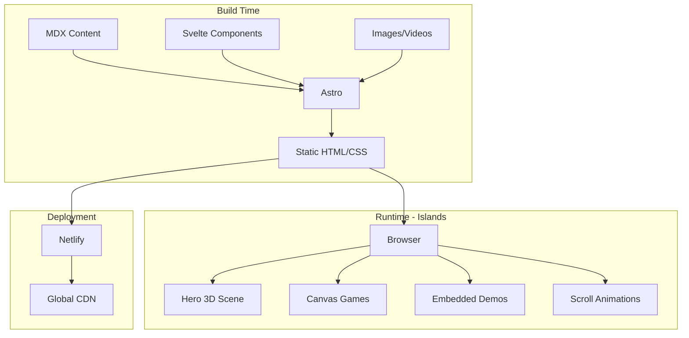

# Portfolio Website Architecture Plan (Updated)

## Recommended Stack

**Core Framework: Astro + Svelte**

| Technology | Purpose |
|------------|---------|
| **Astro** | Static site generator with island architecture for fast loading |
| **Svelte** | Interactive components with built-in animations and small bundles |
| **@threlte/core** | Modern Three.js wrapper for Svelte (actively maintained) |
| **GSAP** | Advanced scroll animations and timelines |
| **MDX** | Content management for projects (Markdown for simple content) |
| **Tailwind CSS** | Utility-first styling with responsive design |
| **TypeScript** | Type safety across the codebase (strict mode enabled) |
| **Shiki** | Syntax highlighting for code snippets (built into Astro) |
| **Lucide Svelte** | Modern, minimal icon library |
| **Astro Image** | Built-in image optimization via `astro:assets` |
| **Sentry** | Runtime error tracking and monitoring |

**Why This Stack:**

- Astro's partial hydration means 90% of your site ships zero JS (instant load)
- Svelte components only hydrate when needed (games, 3D, simulations)
- Svelte has superior built-in animations compared to React
- @threlte/core provides declarative Three.js with better Svelte integration
- MDX allows mixing Markdown with interactive Svelte components
- Excellent Lighthouse scores out of the box
- View Transitions API for smooth page navigation



---

## Theme System

**Dark/Light Mode with System Preference Detection**

- Default theme: System preference detection
- User toggle: Switch between dark/light modes
- Persistence: Save preference in localStorage
- No flash: Theme applied before page render (inline script)
- Smooth transitions: Theme switch animations
- Easter egg: Hidden konami code or secret interaction

## Typography & Icons

**Fonts (Local, Self-hosted, Optimized):**

Recommended font pairs:

1. **Geist Sans + Geist Mono** (Vercel's modern font family)
   - Body: Geist Sans (clean, modern, excellent readability)
   - Code: Geist Mono (designed for technical content)

2. **Inter + JetBrains Mono** (Popular open-source combo)
   - Body: Inter (optimized for screens, variable font)
   - Code: JetBrains Mono (ligatures, programming-focused)

**Recommendation:** Geist Sans + Geist Mono for modern, cohesive look

**Font Optimization Strategy:**
- Use variable font versions to reduce file count
- Subset fonts to only needed character ranges (Latin + Latin Extended)
- Use `font-display: swap` for better perceived performance
- Preload critical font files

**Icons:** Lucide Svelte (modern, minimal, tree-shakeable)

## Proposed Sections (7 Total)

### 1. Hero / Introduction

- Fullscreen landing with your name and title
- Interactive background using lightweight Canvas 2D or CSS animations (measure Three.js impact first)
- Use `client:visible` directive for heavy animations (performance optimization)
- Animated tagline highlighting embedded systems + software expertise
- Quick navigation and scroll indicator
- Theme toggle in header
- **Fallback:** Simple CSS gradient background for browsers without WebGL or if bundle exceeds targets

### 2. About

- Professional story and background
- Photo or stylized avatar
- Key highlights (years of experience, projects delivered, specializations)
- Downloadable resume/CV link

### 3. Projects

- Filterable grid (Software / Embedded / Full-Stack) with ARIA live regions
- Each project card shows: title, tech stack, thumbnail, brief description
- **Approach: Dedicated pages** (using `projects/[slug].astro` for better SEO and shareability)
- Project detail pages include:
  - Problem statement
  - Technical approach
  - Code snippets with syntax highlighting (using Shiki)
  - Images/videos/diagrams
  - Links to GitHub, live demos, documentation

### 4. Skills & Tools

- Visual representation of technical skills
- Categories: Languages, Frameworks, Hardware/MCUs, Tools, Protocols
- Interactive skill graph or animated bars
- Certifications and notable achievements

### 5. Lab / Experiments

**Note:** Deferred to Phase 4+ to ensure core site meets performance budgets

This is your differentiator - interactive demonstrations:

- **Embedded Simulations**: Visualize how a PID controller works, LED matrix patterns, signal processing
- **Mini Games**: Snake, Pong, or a custom game showcasing your skills
- **3D Models**: Interactive 3D renders of hardware projects
- **Live Code Playgrounds**: Embedded code snippets users can modify
- **Performance Consideration**: Each feature will be measured for bundle size impact before integration

### 6. Contact

- Contact form with Netlify Forms integration
- Email notifications to: aelejandro9@proton.me
- **Submission limit notice:** Displays remaining submissions or fallback
- **Fallback:** `mailto:` link when forms disabled or limit reached
- Spam protection: Honeypot + Cloudflare Turnstile
- Client-side validation with error states
- Social links (GitHub, LinkedIn, email)
- Availability status for freelance/consulting
- Success/error feedback messages

### 7. Privacy Policy

- Data collection disclosure (Netlify Analytics, Cloudflare Turnstile)
- Cookie usage (Turnstile CAPTCHA)
- Form data handling
- Third-party services (YouTube embeds, Sentry)
- User rights and contact information
- GDPR compliance statement

---

## Project Structure

```
portfolio/
├── src/
│   ├── components/
│   │   ├── common/          # Navbar, Footer, Button, ThemeToggle, etc.
│   │   ├── sections/        # Hero, About, Projects, Skills, Lab, Contact
│   │   ├── interactive/     # Games, 3D scenes, simulations, easter eggs
│   │   ├── ui/              # Cards, Modals, Animations, LoadingStates, ErrorBoundary
│   │   └── seo/             # SEO components, metadata utilities
│   ├── content/
│   │   ├── projects/        # MDX/Markdown files for each project
│   │   ├── pages/           # Privacy policy, etc.
│   │   └── config.ts        # Content collection schemas
│   ├── layouts/
│   │   ├── BaseLayout.astro # Main HTML structure with theme support
│   │   ├── ProjectLayout.astro # Layout for project detail pages
│   │   └── PageLayout.astro # Layout for static pages (privacy, etc.)
│   ├── pages/
│   │   ├── index.astro      # Main single-page portfolio
│   │   ├── 404.astro        # Custom 404 page
│   │   ├── privacy.astro    # Privacy policy page
│   │   ├── projects/
│   │   │   └── [slug].astro # Dynamic project detail pages
│   │   ├── manifest.json.ts # Simple manifest for "Add to Home Screen"
│   │   └── robots.txt.ts    # Robots.txt (dynamic)
│   ├── lib/
│   │   ├── games/           # Game logic (canvas/WebGL) - Phase 4+
│   │   ├── utils/           # Utility functions, theme helpers
│   │   ├── constants.ts     # Site-wide constants
│   │   ├── analytics.ts     # Analytics utilities (Netlify Analytics)
│   │   └── sentry.ts        # Sentry error tracking setup
│   ├── styles/
│   │   ├── global.css       # Tailwind + custom styles
│   │   └── themes.css       # Theme-specific CSS variables
│   └── types/               # TypeScript type definitions
├── public/
│   ├── images/
│   │   ├── projects/        # Project images organized by project
│   │   ├── og/              # Open Graph images (manual per project)
│   │   └── avatars/         # Personal photos/avatars
│   ├── fonts/               # Self-hosted fonts (subsetted, variable)
│   ├── models/              # 3D models (.glb/.gltf) - Phase 4+
│   └── icons/               # Favicons and "Add to Home Screen" icons
├── tests/
│   ├── unit/                # Vitest unit tests (Phase 7)
│   └── e2e/                 # Playwright E2E tests (Phase 8)
├── .github/
│   └── workflows/
│       ├── ci.yml           # CI pipeline (lint, build)
│       └── lighthouse.yml   # Lighthouse CI (post-launch, warnings only)
├── astro.config.mjs         # Astro configuration
├── tailwind.config.mjs      # Tailwind configuration
├── tsconfig.json            # TypeScript configuration (strict mode)
├── vitest.config.ts         # Vitest configuration
├── playwright.config.ts     # Playwright configuration
├── package.json             # Dependencies and scripts
├── netlify.toml             # Netlify deployment configuration
├── .gitignore               # Git ignore patterns
├── .eslintrc.cjs            # ESLint configuration
├── .prettierrc              # Prettier configuration
├── .browserslistrc          # Browser targets (modern browsers only)
├── .env.example             # Example environment variables
└── README.md                # Project documentation
```

---

## Netlify Configuration

**Use `netlify.toml` file** (more reliable than UI settings)

```toml
[build]
  command = "npm run build"
  publish = "dist"

[build.environment]
  NODE_VERSION = "20"

# Security headers (improved CSP)
[[headers]]
  for = "/*"
  [headers.values]
    X-Frame-Options = "DENY"
    X-Content-Type-Options = "nosniff"
    X-XSS-Protection = "1; mode=block"
    Referrer-Policy = "strict-origin-when-cross-origin"
    Permissions-Policy = "camera=(), microphone=(), geolocation=()"
    # Content Security Policy (stricter - use nonces for inline scripts)
    # Adjust as needed for your integrations
    Content-Security-Policy = "default-src 'self'; script-src 'self' 'nonce-{NONCE_PLACEHOLDER}' https://challenges.cloudflare.com https://js.sentry-cdn.com; style-src 'self' 'nonce-{NONCE_PLACEHOLDER}'; img-src 'self' data: https:; font-src 'self' data:; connect-src 'self' https://challenges.cloudflare.com https://sentry.io; frame-src https://challenges.cloudflare.com https://www.youtube-nocookie.com; object-src 'none'; base-uri 'self'; form-action 'self'"

# Cache static assets
[[headers]]
  for = "/fonts/*"
  [headers.values]
    Cache-Control = "public, max-age=31536000, immutable"

[[headers]]
  for = "/images/*"
  [headers.values]
    Cache-Control = "public, max-age=31536000, immutable"

# 404 redirect
[[redirects]]
  from = "/*"
  to = "/404"
  status = 404

# 301 redirects for removed/renamed projects
# Example: Old project URLs redirect to new ones
# [[redirects]]
#   from = "/projects/old-slug"
#   to = "/projects/new-slug"
#   status = 301

# Form notifications
[form.settings]
  recipients = ["aelejandro9@proton.me"]

# Enable Netlify Analytics
[build.analytics]
  enabled = true
```

**Branch Strategy (GitHub Flow - Simplified):**

| Branch | Purpose | Deploy Target |
|--------|---------|---------------|
| **main** | Production code | Production (Netlify) |
| **feature/** | Feature development | Deploy preview per PR |

**Netlify Build Settings:**

| Field | Value |
|-------|-------|
| **Production branch** | `main` |
| **Base directory** | *(leave empty)* |
| **Build command** | `npm run build` |
| **Publish directory** | `dist` |

**Netlify Forms Setup:**

- Forms use `netlify` attribute in HTML
- Email notifications sent to: aelejandro9@proton.me
- Spam protection: Honeypot + Cloudflare Turnstile
- Form submissions viewable in Netlify dashboard
- **Free tier limit:** 100 submissions/month (display notice + mailto fallback)

---

## Implementation Phases

### Phase 0: Project Setup & Tooling

- Initialize Astro project with all integrations (Svelte, Tailwind, TypeScript, MDX, sitemap)
- Install and configure dependencies (see Dependencies section)
- Set up local font files (Geist Sans + Geist Mono variable fonts, subsetted)
- Configure TypeScript with strict mode enabled
- Configure ESLint and Prettier
- Enable Astro experimental features (contentCollectionCache)
- Create `.env.example` with required variables
- Set up `netlify.toml` with improved security headers
- Add `.browserslistrc` for modern browsers only (no IE11)
- Initialize Git with GitHub Flow (main + feature branches)
- Set up Sentry project for error tracking

### Phase 1: Foundation & Theme System

- Create base layout with semantic HTML structure
- Implement dark/light theme system with toggle
  - System preference detection
  - localStorage persistence
  - No-flash inline script with CSP nonce
  - Theme CSS variables
  - Smooth theme transitions
- Build responsive navigation with mobile hamburger menu
  - Document skip link implementation
  - Keyboard navigation support
- Add footer with social links
- Set up global styles with Tailwind
  - Add `prefers-contrast: high` support
  - Image borders/shadows in dark mode
- Configure content collections schema (`src/content/config.ts`)
- Add View Transitions API integration
- Create SEO components and metadata utilities
- Set up error boundaries for Svelte components
- Basic linting + manual testing

### Phase 2: Static Sections

- Build Hero section
  - **Start with:** Lightweight Canvas 2D or CSS animations
  - **Measure bundle size** before considering Three.js
  - Include WebGL fallback (simple CSS version)
- Implement About section with photo and resume download
- Build Skills section with animated visualizations
  - Conditional animation loading (respect prefers-reduced-motion)
- Create Contact section with Netlify Forms + Cloudflare Turnstile
  - Client-side validation
  - Error/success states
  - Submission limit notice
  - `mailto:` fallback link
  - Email to aelejandro9@proton.me
- Implement scroll animations with GSAP (conditionally loaded)
  - Respect `prefers-reduced-motion`
  - Progressive enhancement approach
- Create Privacy Policy page
  - Netlify Analytics disclosure (GDPR-compliant, server-side)
  - Cloudflare Turnstile cookie notice
  - Sentry error tracking disclosure

### Phase 3: Projects Section

- Set up content collection with TypeScript schema (enhanced)
  - Add `archived: boolean` field
  - Add `lastUpdated: date` field
  - Add `order: number` field
- Create project cards with filterable grid (Svelte)
  - Filter by category (Software/Embedded/Full-Stack)
  - ARIA live regions for filter announcements
  - Animated transitions
  - Loading states
- Build project detail pages with syntax highlighting (Shiki)
  - Problem statement, approach, results
  - Code snippets with proper highlighting
  - Conditional YouTube preconnect (only if videos present)
  - Manual Open Graph images per project
  - Enhanced Schema.org structured data
- Implement project navigation (prev/next)
- Add breadcrumbs for better UX
- Configure 301 redirects for removed/renamed projects

### Phase 4: Interactive Lab & Measurements

**CRITICAL: Measure bundle size impact before adding each feature**

- Performance audit of core site
- Measure current bundle size and Core Web Vitals
- Implement canvas game(s) with loading states (if budget allows)
- Add @threlte/core 3D visualizations (if bundle size permits)
  - Use `client:visible` or `client:idle`
  - Aggressive code splitting
- Create embedded systems simulations (incrementally)
  - PID controller visualization
  - LED matrix patterns
  - Signal processing demos
- Add hidden easter eggs throughout the site
  - Secret interactions
  - Hidden achievements
  - Fun surprises for curious visitors

### Phase 5: Enhanced SEO & Accessibility

- Generate sitemap with @astrojs/sitemap
- Create robots.txt
- Add comprehensive Schema.org structured data
  - Person schema
  - WebSite schema (for site search)
  - BreadcrumbList schema (for navigation)
  - CreativeWork schema (for projects)
  - SoftwareApplication schema (for software projects)
- Optimize images with modern formats (WebP, AVIF)
  - Responsive images with srcset
  - Lazy loading with native loading="lazy"
  - Proper alt text
  - Dark mode borders/shadows
- Optimize fonts
  - Variable font loading
  - Font subsetting (Latin + Latin Extended only)
  - font-display: swap
- Implement resource hints (conditional preconnect for YouTube)
- Code splitting and bundle optimization
- Compress assets (images, videos)
- Set up preload for critical assets
- Create custom 404 page
- Document skip link in navigation
- Ensure ARIA live regions for dynamic content

### Phase 6: Performance Optimization

- Use `astro-compress` for post-build compression
- Implement image optimization as separate build step
- Code splitting verification
- Bundle size analysis and optimization
- Lazy loading verification
- Core Web Vitals measurement
- Cross-browser testing (Chrome, Firefox, Safari, Edge)
- Mobile device testing (real devices)
- Print styles testing

### Phase 7: Testing & Quality Assurance

- Write unit tests for utility functions (Vitest)
  - Theme helpers
  - Validation functions
  - Content utilities
- Run basic E2E tests with Playwright
  - Navigation
  - Contact form submission
  - Project filtering
  - Theme switching
- Manual accessibility testing
  - Keyboard navigation
  - Screen reader compatibility
  - Focus management
  - Color contrast verification
- Performance audit with Lighthouse (local)
  - Target: 90+ performance score
  - Document any issues

### Phase 8: Analytics & Monitoring

- Verify Netlify Analytics is working
- Configure Sentry error tracking
  - Source maps upload
  - Release tracking
  - Performance monitoring
- Test Cloudflare Turnstile
- Test form submission and email notifications
- Verify privacy policy covers all data collection

### Phase 9: Documentation & Deployment

- Write comprehensive README.md
  - Project overview
  - Tech stack explanation
  - Setup instructions
  - Development workflow
  - Deployment process
  - GitHub Flow branching strategy
- Document component APIs
- Add inline code comments (simple, developer-focused)
- Create deployment checklist
- Final QA testing on deploy preview
- Deploy to production (main branch)
- Post-deployment smoke tests
- Monitor Sentry for errors
- Check Netlify Analytics

### Phase 10: Post-Launch (Optional)

- Add Lighthouse CI to GitHub Actions (warnings only, not blockers)
  - Run on every PR
  - Track performance over time
  - Don't block merges
- Add E2E tests for critical user flows
- Consider accessibility testing automation (@axe-core/playwright)
- Monitor bundle size and performance metrics
- Quarterly dependency updates (manual)

---

## Key Files to Create First

1. `package.json` - Dependencies and scripts
2. `astro.config.mjs` - Astro configuration with Svelte and MDX
3. `tailwind.config.mjs` - Theme colors, fonts, and utilities
4. `tsconfig.json` - TypeScript strict mode configuration
5. `src/layouts/BaseLayout.astro` - Main HTML structure with CSP nonces
6. `src/pages/index.astro` - Homepage importing all sections

---

## Dependencies to Install

### Core Framework

```json
{
  "astro": "^4.0.0",
  "svelte": "^4.2.0",
  "@astrojs/svelte": "^5.0.0",
  "@astrojs/mdx": "^2.0.0",
  "@astrojs/tailwind": "^5.0.0",
  "@astrojs/sitemap": "^3.0.0",
  "@astrojs/ts-plugin": "^1.0.0"
}
```

### Styling & Icons

```json
{
  "tailwindcss": "^3.4.0",
  "autoprefixer": "^10.4.0",
  "@tailwindcss/typography": "^0.5.10",
  "@tailwindcss/forms": "^0.5.7",
  "lucide-svelte": "^0.300.0"
}
```

### Interactive & 3D (Phase 4+, conditional)

```json
{
  "@threlte/core": "^7.0.0",
  "@threlte/extras": "^8.0.0",
  "three": "^0.160.0",
  "gsap": "^3.12.0",
  "@types/three": "^0.160.0"
}
```

### Content & Validation

```json
{
  "zod": "^3.22.0"
}
```

Note: Shiki is built into Astro, no need to install separately

### Development & Code Quality

```json
{
  "typescript": "^5.3.0",
  "@typescript-eslint/parser": "^6.0.0",
  "@typescript-eslint/eslint-plugin": "^6.0.0",
  "eslint": "^8.56.0",
  "eslint-plugin-astro": "^0.31.0",
  "eslint-plugin-svelte": "^2.35.0",
  "prettier": "^3.1.0",
  "prettier-plugin-astro": "^0.12.0",
  "prettier-plugin-svelte": "^3.1.0",
  "prettier-plugin-tailwindcss": "^0.5.0"
}
```

### Testing (Phase 7+)

```json
{
  "vitest": "^1.0.0",
  "@vitest/ui": "^1.0.0",
  "playwright": "^1.40.0",
  "@playwright/test": "^1.40.0",
  "@testing-library/svelte": "^4.0.0"
}
```

### Error Tracking

```json
{
  "@sentry/astro": "^7.0.0",
  "@sentry/svelte": "^7.0.0"
}
```

### Build Tools

```json
{
  "vite": "^5.0.0",
  "astro-compress": "^2.0.0"
}
```

---

## Content Collection Schema (Enhanced)

Define project schema in `src/content/config.ts`:

```typescript
import { defineCollection, z } from 'astro:content';

const projects = defineCollection({
  type: 'content',
  schema: ({ image }) => z.object({
    title: z.string(),
    description: z.string(),
    category: z.enum(['Software', 'Embedded', 'Full-Stack']),
    techStack: z.array(z.string()),
    thumbnail: image(), // Astro image optimization
    githubUrl: z.string().url().optional(),
    liveUrl: z.string().url().optional(),
    youtubeUrl: z.string().url().optional(), // YouTube embed
    featured: z.boolean().default(false),
    date: z.date(),
    lastUpdated: z.date().optional(), // Track project updates
    ogImage: z.string().optional(), // Manual OG image path per project
    draft: z.boolean().default(false), // Hide draft projects
    archived: z.boolean().default(false), // Mark old/archived projects
    tags: z.array(z.string()).optional(), // Additional tags for filtering
    order: z.number().optional(), // Manual ordering
  }),
});

const pages = defineCollection({
  type: 'content',
  schema: z.object({
    title: z.string(),
    description: z.string(),
    lastUpdated: z.date(),
  }),
});

export const collections = { projects, pages };
```

**Content Strategy:**

- Use MDX for projects with interactive components
- Use Markdown for simple projects (better build performance)
- Store project images in `/public/images/projects/{project-slug}/`
- Store manual OG images in `/public/images/og/{project-slug}.png`
- YouTube videos: Use `youtubeUrl` field and embed with iframe
- Use `archived: true` for old projects (show in separate section or hide by default)
- Use `lastUpdated` to show "Updated X days ago" badges
- Configure 301 redirects in `netlify.toml` for removed project URLs

---

## Three.js Integration Strategy (Phase 4+)

**Measurement-First Approach:**

1. **Baseline Measurement:**
   - Build core site (Phases 1-3)
   - Measure bundle size and Core Web Vitals
   - Document performance baseline

2. **Hero Section Decision:**
   - **Option A (Recommended):** Start with CSS animations or lightweight Canvas 2D
   - **Option B:** If bundle budget allows, use @threlte/core with aggressive splitting
   - **Fallback:** Always provide CSS-only version for non-WebGL browsers

3. **Using @threlte/core (if approved by measurements):**

```svelte
<script>
  import { Canvas } from '@threlte/core';
  import { OrbitControls } from '@threlte/extras';
  import Scene from './Scene.svelte';
</script>

<Canvas>
  <Scene />
  <OrbitControls />
</Canvas>
```

**Performance Optimization:**

- Use `client:visible` directive for Three.js components (load when in viewport)
- Use `client:idle` for below-the-fold 3D scenes
- Implement loading states for 3D assets
- Keep Three.js bundle separate from main bundle via manual chunking
- **WebGL fallback:** Detect WebGL support and show CSS alternative
- Measure impact on Core Web Vitals before merging

**WebGL Fallback Example:**

```svelte
<script>
  import { onMount } from 'svelte';
  
  let hasWebGL = false;
  
  onMount(() => {
    const canvas = document.createElement('canvas');
    hasWebGL = !!(canvas.getContext('webgl') || canvas.getContext('experimental-webgl'));
  });
</script>

{#if hasWebGL}
  <Canvas><!-- 3D scene --></Canvas>
{:else}
  <div class="css-fallback">
    <!-- CSS gradient/animation alternative -->
  </div>
{/if}
```

---

## GSAP Integration Notes

**Conditional Loading with Progressive Enhancement:**

```astro
---
// Only import GSAP in components that use it
---

<div id="animated-section">
  <!-- Content -->
</div>

<script>
  // Only load GSAP if user hasn't set prefers-reduced-motion
  const prefersReducedMotion = window.matchMedia('(prefers-reduced-motion: reduce)').matches;
  
  if (!prefersReducedMotion) {
    import('gsap').then(({ gsap }) => {
      import('gsap/ScrollTrigger').then(({ ScrollTrigger }) => {
        gsap.registerPlugin(ScrollTrigger);
        
        // Your animations here
        gsap.from('#animated-section', {
          opacity: 0,
          y: 50,
          scrollTrigger: {
            trigger: '#animated-section',
            start: 'top 80%',
          }
        });
      });
    });
  }
</script>
```

**Best Practices:**

- Use `client:load` for above-the-fold animations (sparingly)
- Use `client:visible` for scroll-triggered animations (better performance)
- Always respect `prefers-reduced-motion`
- Use IntersectionObserver for performance optimization
- Clean up ScrollTrigger instances on component destroy
- Use GSAP timeline for complex animation sequences
- Debounce resize events for responsive animations

---

## Accessibility Requirements (WCAG AA)

**Semantic HTML:**

- Use proper landmarks: `<nav>`, `<main>`, `<section>`, `<article>`, `<aside>`, `<footer>`
- Heading hierarchy (h1 → h2 → h3, no skipping)
- Lists for navigation and repeated content

**Skip Link Implementation:**

```html
<!-- First focusable element in <body> -->
<a href="#main-content" class="skip-link">
  Skip to main content
</a>

<!-- Main content area -->
<main id="main-content">
  <!-- Page content -->
</main>
```

```css
.skip-link {
  position: absolute;
  top: -40px;
  left: 0;
  background: var(--color-primary);
  color: white;
  padding: 8px 16px;
  text-decoration: none;
  z-index: 100;
}

.skip-link:focus {
  top: 0;
}
```

**ARIA Labels:**

- Label all interactive elements
- Use `aria-label` or `aria-labelledby` where needed
- Add `role` attributes when semantic HTML isn't enough
- Mark loading/error states with `aria-live` regions

**ARIA Live Regions for Dynamic Content:**

```svelte
<!-- Project filtering with announcements -->
<div aria-live="polite" aria-atomic="true" class="sr-only">
  {filteredProjects.length} projects found
</div>

<div class="projects-grid">
  {#each filteredProjects as project}
    <!-- Project cards -->
  {/each}
</div>
```

**Keyboard Navigation:**

- All interactive elements keyboard accessible
- Logical tab order
- Visible focus indicators (custom focus ring styles, 3px minimum)
- Skip to main content link (documented above)
- Escape key closes modals/dropdowns
- Arrow keys for sliders/carousels

**Visual Accessibility:**

- Color contrast: 4.5:1 for normal text, 3:1 for large text
- Don't rely on color alone for information
- Alt text for all images (descriptive, not decorative)
- Focus indicators (3px minimum, high contrast)
- Minimum touch target size: 44x44px (mobile)
- Support `prefers-contrast: high` media query

**High Contrast Support:**

```css
@media (prefers-contrast: high) {
  :root {
    --color-border: #000000;
    --color-text: #000000;
  }
  
  [data-theme="dark"] {
    --color-border: #ffffff;
    --color-text: #ffffff;
  }
  
  /* Increase border widths */
  button, input, select, textarea {
    border-width: 2px;
  }
}
```

**Animation Accessibility:**

- Respect `prefers-reduced-motion` site-wide
- Disable parallax, auto-play, and complex animations
- Provide static alternatives

**Testing Strategy:**

- Manual keyboard-only navigation testing
- Manual screen reader testing (NVDA, JAWS, VoiceOver)
- Color contrast checker tools
- Optional (Phase 10): @axe-core/playwright for automated testing

---

## Performance Targets

**Core Web Vitals:**

- Largest Contentful Paint (LCP): < 2.5s
- First Input Delay (FID): < 100ms
- Cumulative Layout Shift (CLS): < 0.1
- Interaction to Next Paint (INP): < 200ms

**Additional Metrics:**

- Lighthouse Performance Score: 90+
- First Contentful Paint (FCP): < 1.5s
- Time to Interactive (TTI): < 3.5s
- Total Blocking Time (TBT): < 200ms
- Speed Index: < 3.0s

**Bundle Size:**

- Initial load (gzipped): < 200KB
- Total JS (gzipped): < 300KB
- Individual route chunks: < 50KB each
- Critical CSS: < 20KB inline

**Monitoring:**

- Lighthouse CI in GitHub Actions (Phase 10, warnings only)
- Sentry Performance Monitoring for production metrics
- Performance budgets documented (not enforced in CI initially)
- Manual performance checks before major feature additions

---

## Browser Support

**Target Browsers (.browserslistrc):**

```
> 0.5%
last 2 versions
not dead
Firefox ESR
iOS >= 12
Android >= 6
```

**Note:** IE11 support removed (end of life 2022)

**Support Strategy:**

- Modern browsers (last 2 versions): Full feature support
- Older mobile browsers (iOS 12+, Android 6+): Progressive enhancement
- No IE11 support (saves significant bundle size and complexity)

**Progressive Enhancement:**

- CSS Grid with fallback to Flexbox
- CSS Custom Properties with fallback values
- View Transitions with graceful degradation
- WebGL/Three.js with CSS fallback
- GSAP animations respect prefers-reduced-motion

**Testing Matrix:**

- Chrome (latest)
- Firefox (latest + ESR)
- Safari (latest on macOS and iOS)
- Edge (latest)
- Samsung Internet (latest)
- Chrome Mobile (Android 6+)
- Safari Mobile (iOS 12+)

---

## Simple Manifest (No PWA Service Worker)

**Manifest (`src/pages/manifest.json.ts`):**

```typescript
export async function GET() {
  const manifest = {
    name: 'Your Name - Portfolio',
    short_name: 'Portfolio',
    description: 'Embedded Systems & Software Engineer Portfolio',
    start_url: '/',
    display: 'browser', // Don't use standalone (no PWA)
    background_color: '#ffffff',
    theme_color: '#000000',
    icons: [
      { src: '/icons/icon-192.png', sizes: '192x192', type: 'image/png' },
      { src: '/icons/icon-512.png', sizes: '512x512', type: 'image/png' }
    ]
  };
  
  return new Response(JSON.stringify(manifest), {
    headers: { 'Content-Type': 'application/json' }
  });
}
```

**Purpose:**

- Provides basic "Add to Home Screen" support on mobile
- Sets theme color for browser chrome
- No service worker = simpler maintenance
- No offline support complexity

---

## Theme System Implementation

**CSS Variables (`src/styles/themes.css`):**

```css
:root {
  --color-bg: #ffffff;
  --color-text: #000000;
  --color-primary: #0066cc;
  --color-secondary: #666666;
  --color-accent: #ff6b6b;
  --color-border: #e0e0e0;
  --color-card-bg: #f5f5f5;
}

[data-theme="dark"] {
  --color-bg: #0a0a0a;
  --color-text: #ffffff;
  --color-primary: #3b82f6;
  --color-secondary: #a0a0a0;
  --color-accent: #f87171;
  --color-border: #2a2a2a;
  --color-card-bg: #1a1a1a;
}

/* Dark mode image styling */
[data-theme="dark"] img {
  border: 1px solid var(--color-border);
  box-shadow: 0 2px 8px rgba(0, 0, 0, 0.3);
}

/* High contrast support */
@media (prefers-contrast: high) {
  :root {
    --color-border: #000000;
    --color-text: #000000;
  }
  
  [data-theme="dark"] {
    --color-border: #ffffff;
    --color-text: #ffffff;
  }
}
```

**Theme Toggle Component:**

```svelte
<script lang="ts">
  import { onMount } from 'svelte';
  import { Sun, Moon } from 'lucide-svelte';
  
  let theme = 'light';
  
  onMount(() => {
    // Check system preference and localStorage
    const stored = localStorage.getItem('theme');
    const prefersDark = window.matchMedia('(prefers-color-scheme: dark)').matches;
    theme = stored || (prefersDark ? 'dark' : 'light');
    applyTheme(theme);
  });
  
  function applyTheme(newTheme: string) {
    document.documentElement.setAttribute('data-theme', newTheme);
    localStorage.setItem('theme', newTheme);
    theme = newTheme;
  }
  
  function toggleTheme() {
    applyTheme(theme === 'light' ? 'dark' : 'light');
  }
</script>

<button 
  on:click={toggleTheme} 
  aria-label={`Switch to ${theme === 'light' ? 'dark' : 'light'} mode`}
  class="theme-toggle"
>
  {#if theme === 'light'}
    <Moon />
  {:else}
    <Sun />
  {/if}
</button>
```

**No-Flash Script with CSP Nonce (in `<head>`):**

```astro
---
// Generate nonce for CSP
const nonce = Math.random().toString(36).substring(2);
---

<head>
  <!-- CSP headers will reference this nonce -->
  <script is:inline nonce={nonce}>
    (function() {
      const stored = localStorage.getItem('theme');
      const prefersDark = window.matchMedia('(prefers-color-scheme: dark)').matches;
      const theme = stored || (prefersDark ? 'dark' : 'light');
      document.documentElement.setAttribute('data-theme', theme);
    })();
  </script>
</head>
```

---

## Testing Strategy

**Phase 0-3: Manual Testing + Linting**

- ESLint for code quality
- Prettier for formatting
- Manual browser testing
- Manual accessibility checks (keyboard, screen reader)
- Focus on rapid development

**Phase 7: Unit Tests (Vitest)**

- Utility functions (theme helpers, validation, formatting)
- Content collection schema validation
- Component logic (isolated from DOM)
- Run locally before commits

**Phase 8: E2E Tests (Playwright)**

- Critical user flows:
  - Homepage navigation
  - Project filtering and detail pages
  - Contact form submission
  - Theme switching
  - Mobile navigation
- Run locally before major releases

**Phase 10 (Post-Launch): Automated Testing**

- Optional: Add @axe-core/playwright for accessibility testing
- Optional: Add Lighthouse CI as warnings (not blockers)
- Continue manual testing for new features

**Test Commands:**

```json
{
  "scripts": {
    "test": "vitest",
    "test:unit": "vitest run",
    "test:e2e": "playwright test",
    "lint": "eslint . && prettier --check ."
  }
}
```

---

## Video Embed Strategy (YouTube)

**YouTube Embed Component with Conditional Preconnect:**

```svelte
<script lang="ts">
  export let videoId: string;
  export let title: string;
  
  let loaded = false;
  
  function loadVideo() {
    loaded = true;
  }
</script>

{#if !loaded}
  <div class="video-placeholder" on:click={loadVideo} on:keypress={loadVideo} role="button" tabindex="0">
    
    <button aria-label="Play video" class="play-button">▶</button>
  </div>
{:else}
  <iframe
    src={`https://www.youtube-nocookie.com/embed/${videoId}`}
    title={title}
    frameborder="0"
    allow="accelerometer; autoplay; clipboard-write; encrypted-media; gyroscope; picture-in-picture"
    allowfullscreen
  ></iframe>
{/if}
```

**Conditional Preconnect in Project Layout:**

```astro
---
import { getEntry } from 'astro:content';
const project = await getEntry('projects', slug);
const hasYouTubeVideo = !!project.data.youtubeUrl;
---

<head>
  {hasYouTubeVideo && (
    <>
      <link rel="preconnect" href="https://www.youtube-nocookie.com" />
      <link rel="preconnect" href="https://img.youtube.com" />
    </>
  )}
</head>
```

**Benefits:**

- Lazy loading with facade pattern (better performance)
- Use youtube-nocookie.com for privacy
- Only preconnect when YouTube videos are present
- Keyboard accessible

---

## Easter Eggs Ideas

- Konami code unlocks hidden achievement
- Secret message in console.log
- Hidden animation on specific key combinations
- Interactive element on 404 page
- Special animation on logo click (after N clicks)
- Hidden game accessible via URL parameter
- ASCII art in view source
- Developer-friendly comments in production code

---

## Netlify Forms & Spam Protection

**Form Setup with Submission Limit Notice:**

```svelte
<script lang="ts">
  let formDisabled = false;
  let submissionCount = 0;
  const MONTHLY_LIMIT = 100;
  
  // Check if form is disabled (could be stored in localStorage or fetched from API)
  function checkFormStatus() {
    // Simplified example
    formDisabled = submissionCount >= MONTHLY_LIMIT;
  }
</script>

{#if !formDisabled}
  <form 
    name="contact" 
    method="POST" 
    netlify 
    data-netlify-honeypot="bot-field"
  >
    <input type="hidden" name="form-name" value="contact" />
    
    <!-- Honeypot field (hidden) -->
    <p class="hidden">
      <label>
        Don't fill this out: <input name="bot-field" />
      </label>
    </p>
    
    <!-- Form fields -->
    <input type="text" name="name" required />
    <input type="email" name="email" required />
    <textarea name="message" required></textarea>
    
    <!-- Cloudflare Turnstile -->
    <div class="cf-turnstile" data-sitekey="YOUR_SITE_KEY"></div>
    
    <button type="submit">Send Message</button>
    
    {#if submissionCount > MONTHLY_LIMIT * 0.8}
      <p class="notice">
        Note: {MONTHLY_LIMIT - submissionCount} submissions remaining this month
      </p>
    {/if}
  </form>
{:else}
  <div class="form-disabled">
    <p>The contact form has reached its monthly limit.</p>
    <p>Please email me directly:</p>
    <a href="mailto:aelejandro9@proton.me" class="email-fallback">
      aelejandro9@proton.me
    </a>
  </div>
{/if}

<script src="https://challenges.cloudflare.com/turnstile/v0/api.js" async defer></script>
```

**Environment Variables (.env.example):**

```bash
# Cloudflare Turnstile
PUBLIC_TURNSTILE_SITE_KEY=your_site_key_here

# Sentry Error Tracking
PUBLIC_SENTRY_DSN=your_sentry_dsn_here
SENTRY_AUTH_TOKEN=your_auth_token_here
SENTRY_ORG=your_org
SENTRY_PROJECT=your_project

# Optional: CSP Nonce (generated at build time)
# No manual configuration needed
```

**Form Notifications:**

- Email: aelejandro9@proton.me (configured in netlify.toml)
- Viewable in Netlify dashboard
- Fallback: Direct mailto link when form disabled

---

## Analytics & Monitoring

**Netlify Analytics:**

- Enabled in netlify.toml
- Server-side tracking (no cookies, GDPR-friendly)
- Tracks pageviews, bandwidth, top pages
- No client-side JavaScript needed
- Document in privacy policy

**Sentry Error Tracking:**

```typescript
// src/lib/sentry.ts
import * as Sentry from '@sentry/astro';

export function initSentry() {
  Sentry.init({
    dsn: import.meta.env.PUBLIC_SENTRY_DSN,
    environment: import.meta.env.MODE,
    tracesSampleRate: 1.0,
    integrations: [
      new Sentry.BrowserTracing(),
      new Sentry.Replay({
        maskAllText: true,
        blockAllMedia: true,
      }),
    ],
    replaysSessionSampleRate: 0.1,
    replaysOnErrorSampleRate: 1.0,
  });
}
```

```astro
---
// src/layouts/BaseLayout.astro
import { initSentry } from '../lib/sentry';
---

<script>
  // Initialize Sentry on client
  import { initSentry } from '../lib/sentry';
  initSentry();
</script>
```

**Lighthouse CI (Phase 10, Optional):**

```yaml
# .github/workflows/lighthouse.yml
name: Lighthouse CI
on: [pull_request]
jobs:
  lighthouse:
    runs-on: ubuntu-latest
    steps:
      - uses: actions/checkout@v3
      - uses: actions/setup-node@v3
      - run: npm ci
      - run: npm run build
      - uses: treosh/lighthouse-ci-action@v10
        with:
          urls: |
            http://localhost:4321
          uploadArtifacts: true
          # Don't fail CI on performance drops (warnings only)
```

---

## Git Workflow (GitHub Flow)

**Branch Strategy:**

```
main (production, deployed to Netlify)
  ├── feature/hero-section
  ├── feature/project-filtering
  └── feature/contact-form
```

**Workflow:**

1. **Feature Development:**
   ```bash
   git checkout main
   git pull origin main
   git checkout -b feature/my-feature
   # Make changes
   git add .
   git commit -m "Add feature: description"
   git push origin feature/my-feature
   # Create PR to main
   ```

2. **Deploy Preview:**
   - Netlify automatically creates deploy preview for each PR
   - Review changes on preview URL
   - Test thoroughly

3. **Merge to Production:**
   ```bash
   # After PR approval
   git checkout main
   git merge feature/my-feature
   git push origin main
   # Netlify auto-deploys from main branch
   ```

4. **Hotfix (if needed):**
   ```bash
   git checkout -b hotfix/critical-bug main
   # Fix bug
   git checkout main
   git merge hotfix/critical-bug
   git push origin main
   ```

**Benefits:**

- Simple, straightforward workflow
- Every PR gets deploy preview
- Main branch always deployable
- No complex merge strategies
- Perfect for solo or small team projects

---

## Image Optimization Strategy

**Astro Image Component:**

```astro
---
import { Image } from 'astro:assets';
import myImage from '../assets/project.jpg';
---

<Image 
  src={myImage} 
  alt="Project screenshot"
  width={800}
  height={600}
  format="webp"
  quality={80}
  loading="lazy"
  class="project-image"
/>
```

**Format Strategy:**

- **Primary:** WebP (broad support, good compression)
- **Fallback:** Astro handles automatic fallbacks
- Optimize images before adding (ImageOptim, Squoosh)

**Responsive Images:**

```astro
<Image 
  src={myImage}
  alt="Description"
  widths={[320, 640, 960, 1280]}
  sizes="(max-width: 640px) 100vw, (max-width: 1024px) 50vw, 33vw"
  format="webp"
/>
```

**Image Organization:**

```
public/images/
  ├── projects/
  │   ├── embedded-system/
  │   │   ├── hero.jpg
  │   │   └── diagram.png
  │   └── web-app/
  │       ├── screenshot.jpg
  │       └── demo.gif
  ├── og/
  │   ├── project-1.png (1200x630)
  │   └── project-2.png (1200x630)
  └── avatars/
      └── profile.jpg
```

**Build-Time Optimization:**

```json
{
  "scripts": {
    "optimize:images": "npx @squoosh/cli --webp auto public/images/**/*.{jpg,png}",
    "prebuild": "npm run optimize:images"
  }
}
```

**Dark Mode Image Styling:**

- Add subtle border/shadow to images in dark mode (via CSS in themes.css)
- Use `<picture>` with media queries for images needing dark variants (rare)

---

## Code Quality & Linting

**ESLint Configuration (.eslintrc.cjs):**

```javascript
module.exports = {
  extends: [
    'eslint:recommended',
    'plugin:@typescript-eslint/recommended',
    'plugin:astro/recommended',
    'plugin:svelte/recommended'
  ],
  parser: '@typescript-eslint/parser',
  parserOptions: {
    ecmaVersion: 'latest',
    sourceType: 'module',
    extraFileExtensions: ['.svelte', '.astro']
  },
  overrides: [
    {
      files: ['*.astro'],
      parser: 'astro-eslint-parser',
      parserOptions: {
        parser: '@typescript-eslint/parser',
        extraFileExtensions: ['.astro']
      }
    },
    {
      files: ['*.svelte'],
      parser: 'svelte-eslint-parser',
      parserOptions: {
        parser: '@typescript-eslint/parser'
      }
    }
  ],
  rules: {
    'no-console': ['warn', { allow: ['warn', 'error'] }],
    '@typescript-eslint/no-unused-vars': 'error'
  }
};
```

**Prettier Configuration (.prettierrc):**

```json
{
  "semi": true,
  "singleQuote": true,
  "tabWidth": 2,
  "useTabs": false,
  "trailingComma": "es5",
  "printWidth": 100,
  "plugins": [
    "prettier-plugin-astro",
    "prettier-plugin-svelte",
    "prettier-plugin-tailwindcss"
  ],
  "overrides": [
    {
      "files": "*.astro",
      "options": {
        "parser": "astro"
      }
    },
    {
      "files": "*.svelte",
      "options": {
        "parser": "svelte"
      }
    }
  ]
}
```

**TypeScript Configuration (tsconfig.json):**

```json
{
  "extends": "astro/tsconfigs/strict",
  "compilerOptions": {
    "strict": true,
    "noUncheckedIndexedAccess": true,
    "jsx": "preserve",
    "jsxImportSource": "svelte",
    "allowJs": true,
    "moduleResolution": "bundler",
    "target": "ES2020",
    "module": "ESNext",
    "lib": ["ES2020", "DOM", "DOM.Iterable"],
    "types": ["astro/client", "svelte", "@types/three"],
    "paths": {
      "@/*": ["./src/*"],
      "@components/*": ["./src/components/*"],
      "@layouts/*": ["./src/layouts/*"],
      "@lib/*": ["./src/lib/*"]
    }
  },
  "include": ["src/**/*"],
  "exclude": ["node_modules", "dist"]
}
```

---

## SEO Strategy

**robots.txt (src/pages/robots.txt.ts):**

```typescript
export async function GET() {
  const robots = `
User-agent: *
Allow: /

# Disallow archived projects (optional)
Disallow: /projects/archived/

Sitemap: https://yourdomain.com/sitemap-index.xml
  `.trim();
  
  return new Response(robots, {
    headers: { 'Content-Type': 'text/plain' }
  });
}
```

**Sitemap Configuration (astro.config.mjs):**

```javascript
import { defineConfig } from 'astro/config';
import sitemap from '@astrojs/sitemap';

export default defineConfig({
  site: 'https://yourdomain.com',
  integrations: [
    sitemap({
      filter: (page) => !page.includes('/404') && !page.includes('/archived'),
      customPages: []
    })
  ]
});
```

**Meta Tags Component:**

```astro
---
// src/components/seo/MetaTags.astro
interface Props {
  title: string;
  description: string;
  ogImage?: string;
  canonical?: string;
}

const { title, description, ogImage, canonical } = Astro.props;
const siteUrl = 'https://yourdomain.com';
const defaultOgImage = `${siteUrl}/images/og/default.png`;
---

<title>{title} | Your Name - Portfolio</title>
<meta name="description" content={description} />
<link rel="canonical" href={canonical || Astro.url.href} />

<!-- Open Graph -->
<meta property="og:type" content="website" />
<meta property="og:url" content={Astro.url.href} />
<meta property="og:title" content={title} />
<meta property="og:description" content={description} />
<meta property="og:image" content={ogImage || defaultOgImage} />

<!-- Twitter -->
<meta name="twitter:card" content="summary_large_image" />
<meta name="twitter:title" content={title} />
<meta name="twitter:description" content={description} />
<meta name="twitter:image" content={ogImage || defaultOgImage} />
```

**Enhanced Schema.org Structured Data:**

```astro
---
// Person schema
const personSchema = {
  "@context": "https://schema.org",
  "@type": "Person",
  "name": "Your Name",
  "jobTitle": "Embedded Systems & Software Engineer",
  "url": "https://yourdomain.com",
  "sameAs": [
    "https://github.com/yourprofile",
    "https://linkedin.com/in/yourprofile"
  ]
};

// WebSite schema (for site search)
const websiteSchema = {
  "@context": "https://schema.org",
  "@type": "WebSite",
  "name": "Your Name - Portfolio",
  "url": "https://yourdomain.com",
  "potentialAction": {
    "@type": "SearchAction",
    "target": "https://yourdomain.com/search?q={search_term_string}",
    "query-input": "required name=search_term_string"
  }
};

// BreadcrumbList for project pages
const breadcrumbSchema = {
  "@context": "https://schema.org",
  "@type": "BreadcrumbList",
  "itemListElement": [
    {
      "@type": "ListItem",
      "position": 1,
      "name": "Home",
      "item": "https://yourdomain.com"
    },
    {
      "@type": "ListItem",
      "position": 2,
      "name": "Projects",
      "item": "https://yourdomain.com/#projects"
    },
    {
      "@type": "ListItem",
      "position": 3,
      "name": "Project Title",
      "item": Astro.url.href
    }
  ]
};

// CreativeWork/SoftwareApplication for projects
const projectSchema = {
  "@context": "https://schema.org",
  "@type": "SoftwareApplication",
  "name": "Project Title",
  "description": "Project description",
  "author": {
    "@type": "Person",
    "name": "Your Name"
  },
  "datePublished": "2024-01-01",
  "programmingLanguage": ["C", "Python", "TypeScript"],
  "codeRepository": "https://github.com/you/repo"
};
---

<script type="application/ld+json" set:html={JSON.stringify(personSchema)} />
<script type="application/ld+json" set:html={JSON.stringify(websiteSchema)} />
```

---

## Mobile-First & Responsive Design

**Breakpoints (Tailwind):**

- `sm`: 640px (mobile landscape, small tablets)
- `md`: 768px (tablets)
- `lg`: 1024px (small laptops)
- `xl`: 1280px (desktops)
- `2xl`: 1536px (large screens)

**Mobile Considerations:**

- Touch targets: minimum 44x44px (Apple)
- Hamburger menu for mobile navigation
- Responsive images with `sizes` attribute
- Avoid hover-only interactions
- Test on real devices (not just DevTools)
- Consider thumb zones for navigation

**Responsive Typography:**

```css
/* global.css */
:root {
  --font-size-base: clamp(1rem, 0.95rem + 0.25vw, 1.125rem);
  --font-size-lg: clamp(1.125rem, 1rem + 0.5vw, 1.5rem);
  --font-size-xl: clamp(1.5rem, 1.25rem + 1vw, 2.5rem);
}
```

**Performance on Mobile:**

- Reduce animations on low-end devices
- Lazy load below-the-fold content
- Minimize JavaScript execution
- Use passive event listeners
- Implement connection-aware loading (optional)

---

## Astro Configuration

**astro.config.mjs (Complete Setup with Optimizations):**

```javascript
import { defineConfig } from 'astro/config';
import svelte from '@astrojs/svelte';
import tailwind from '@astrojs/tailwind';
import mdx from '@astrojs/mdx';
import sitemap from '@astrojs/sitemap';
import compress from 'astro-compress';

export default defineConfig({
  site: 'https://yourdomain.com',
  output: 'static',
  
  integrations: [
    svelte(),
    tailwind({
      applyBaseStyles: false, // Use custom global styles
    }),
    mdx({
      shikiConfig: {
        theme: 'github-dark',
        wrap: true
      }
    }),
    sitemap(),
    compress({
      css: true,
      html: {
        removeAttributeQuotes: false,
      },
      img: false, // Handle images separately
      js: true,
      svg: true,
    })
  ],
  
  vite: {
    build: {
      rollupOptions: {
        output: {
          // Manual chunking for better code splitting
          manualChunks: (id) => {
            // Three.js and Threlte (Phase 4+)
            if (id.includes('three') || id.includes('@threlte')) {
              return 'three';
            }
            // GSAP
            if (id.includes('gsap')) {
              return 'gsap';
            }
            // Vendor chunks
            if (id.includes('node_modules')) {
              return 'vendor';
            }
          }
        }
      }
    },
    optimizeDeps: {
      exclude: ['@sentry/astro']
    }
  },
  
  markdown: {
    shikiConfig: {
      theme: 'github-dark',
      wrap: true
    }
  },
  
  experimental: {
    contentCollectionCache: true, // Faster builds
  }
});
```

---

## Font Optimization

**Font Configuration:**

```css
/* src/styles/global.css */

/* Geist Sans (Variable Font) - Subsetted */
@font-face {
  font-family: 'Geist Sans';
  src: url('/fonts/GeistVF-subset.woff2') format('woff2-variations');
  font-weight: 100 900;
  font-display: swap;
  font-style: normal;
  unicode-range: U+0000-00FF, U+0131, U+0152-0153, U+02BB-02BC, U+02C6, U+02DA, U+02DC, U+2000-206F, U+2074, U+20AC, U+2122, U+2191, U+2193, U+2212, U+2215, U+FEFF, U+FFFD;
}

/* Geist Mono (Variable Font) - Subsetted */
@font-face {
  font-family: 'Geist Mono';
  src: url('/fonts/GeistMonoVF-subset.woff2') format('woff2-variations');
  font-weight: 100 900;
  font-display: swap;
  font-style: normal;
  unicode-range: U+0000-00FF, U+0131, U+0152-0153, U+02BB-02BC, U+02C6, U+02DA, U+02DC, U+2000-206F, U+2074, U+20AC, U+2122, U+2191, U+2193, U+2212, U+2215, U+FEFF, U+FFFD;
}
```

**Font Subsetting Command:**

```bash
# Install pyftsubset (part of fonttools)
pip install fonttools brotli

# Subset fonts to Latin + Latin Extended
pyftsubset GeistVF.woff2 \
  --output-file=GeistVF-subset.woff2 \
  --flavor=woff2 \
  --unicodes="U+0000-00FF,U+0131,U+0152-0153,U+02BB-02BC,U+02C6,U+02DA,U+02DC,U+2000-206F,U+2074,U+20AC,U+2122,U+2191,U+2193,U+2212,U+2215,U+FEFF,U+FFFD"
```

**Preload Critical Fonts:**

```astro
---
// In BaseLayout.astro <head>
---
<link 
  rel="preload" 
  href="/fonts/GeistVF-subset.woff2" 
  as="font" 
  type="font/woff2" 
  crossorigin 
/>
```

---

## View Transitions API

**Enable in BaseLayout.astro:**

```astro
---
import { ViewTransitions } from 'astro:transitions';
---

<!DOCTYPE html>
<html lang="en">
  <head>
    <ViewTransitions />
    <!-- other head elements -->
  </head>
  <body>
    <slot />
  </body>
</html>
```

**Custom Transitions:**

```astro
---
import { fade, slide } from 'astro:transitions';
---

<div transition:animate={fade({ duration: '0.4s' })}>
  Content with fade transition
</div>

<div transition:animate={slide({ duration: '0.6s' })}>
  Content with slide transition
</div>
```

**Persist Elements Across Transitions:**

```astro
<div transition:persist>
  <!-- This element persists across page transitions -->
  <audio src="music.mp3" controls />
</div>
```

---

## Error Handling & Loading States

**Error Boundary for Svelte:**

```svelte
<!-- src/components/ui/ErrorBoundary.svelte -->
<script lang="ts">
  import { onMount } from 'svelte';
  
  export let fallback: string = 'Something went wrong';
  let error: Error | null = null;
  
  onMount(() => {
    window.addEventListener('error', handleError);
    return () => window.removeEventListener('error', handleError);
  });
  
  function handleError(event: ErrorEvent) {
    error = event.error;
    console.error('Error caught:', event.error);
    
    // Send to Sentry
    if (window.Sentry) {
      window.Sentry.captureException(event.error);
    }
  }
</script>

{#if error}
  <div class="error-boundary">
    <h2>Oops! {fallback}</h2>
    <button on:click={() => window.location.reload()}>
      Reload Page
    </button>
  </div>
{:else}
  <slot />
{/if}
```

**Loading States:**

```svelte
<script lang="ts">
  import { onMount } from 'svelte';
  
  let loading = true;
  let data = null;
  
  onMount(async () => {
    try {
      // Simulate loading
      await new Promise(resolve => setTimeout(resolve, 1000));
      data = { message: 'Loaded!' };
    } catch (error) {
      console.error(error);
      if (window.Sentry) {
        window.Sentry.captureException(error);
      }
    } finally {
      loading = false;
    }
  });
</script>

{#if loading}
  <div class="loading-spinner" role="status" aria-live="polite">
    <span class="sr-only">Loading...</span>
  </div>
{:else if data}
  <div>{data.message}</div>
{:else}
  <div>Failed to load</div>
{/if}
```

---

## CI/CD Pipeline (Simplified)

**GitHub Actions (.github/workflows/ci.yml):**

```yaml
name: CI Pipeline

on:
  pull_request:
  push:
    branches: [main]

jobs:
  lint:
    runs-on: ubuntu-latest
    steps:
      - uses: actions/checkout@v3
      - uses: actions/setup-node@v3
        with:
          node-version: '20'
          cache: 'npm'
      - run: npm ci
      - run: npm run lint
      
  build:
    runs-on: ubuntu-latest
    steps:
      - uses: actions/checkout@v3
      - uses: actions/setup-node@v3
        with:
          node-version: '20'
          cache: 'npm'
      - run: npm ci
      - run: npm run build
      - name: Check bundle size
        run: |
          BUNDLE_SIZE=$(du -sb dist | cut -f1)
          echo "Bundle size: $BUNDLE_SIZE bytes"
          # Optional: Fail if bundle exceeds target (300KB = 300000 bytes)
          # if [ $BUNDLE_SIZE -gt 300000 ]; then exit 1; fi
```

---

## Privacy Policy Content (Template)

Create `src/pages/privacy.astro`:

```astro
---
import BaseLayout from '../layouts/BaseLayout.astro';
---

<BaseLayout title="Privacy Policy" description="Privacy policy and data handling">
  <main class="container mx-auto px-4 py-12 max-w-4xl">
    <h1>Privacy Policy</h1>
    <p class="text-sm text-gray-600">Last updated: [Date]</p>

    <section>
      <h2>Data Collection</h2>
      <p>This website collects minimal data to function properly:</p>
      
      <h3>Analytics</h3>
      <ul>
        <li><strong>Netlify Analytics:</strong> Server-side analytics that tracks pageviews and bandwidth. No cookies are set, no personal data is collected. GDPR-compliant.</li>
      </ul>

      <h3>Contact Form</h3>
      <ul>
        <li>When you submit the contact form, your name, email, and message are sent to aelejandro9@proton.me</li>
        <li>Data is processed by Netlify Forms (100 submissions/month free tier)</li>
        <li>Submissions are stored in Netlify's dashboard for review</li>
      </ul>

      <h3>Spam Protection</h3>
      <ul>
        <li><strong>Cloudflare Turnstile:</strong> Used to prevent spam on the contact form. May set cookies for CAPTCHA verification.</li>
      </ul>

      <h3>Error Tracking</h3>
      <ul>
        <li><strong>Sentry:</strong> Tracks runtime errors to improve site stability. Collects browser info, error stack traces, and anonymized user interactions.</li>
      </ul>

      <h3>YouTube Embeds</h3>
      <ul>
        <li>Some project pages may embed YouTube videos using youtube-nocookie.com</li>
        <li>Videos only load when you click to play (facade pattern)</li>
        <li>YouTube may set cookies when videos are played</li>
      </ul>
    </section>

    <section>
      <h2>Cookies</h2>
      <ul>
        <li><strong>Theme Preference:</strong> localStorage (not a cookie) stores your dark/light mode preference</li>
        <li><strong>Cloudflare Turnstile:</strong> May set cookies for CAPTCHA verification</li>
        <li><strong>YouTube:</strong> May set cookies when videos are played</li>
      </ul>
    </section>

    <section>
      <h2>Your Rights</h2>
      <p>You have the right to:</p>
      <ul>
        <li>Request deletion of any data submitted via contact form</li>
        <li>Opt out of analytics (use browser extensions or disable JavaScript)</li>
        <li>Clear your browser's localStorage to reset theme preference</li>
      </ul>
    </section>

    <section>
      <h2>Contact</h2>
      <p>For privacy-related questions, email: <a href="mailto:aelejandro9@proton.me">aelejandro9@proton.me</a></p>
    </section>
  </main>
</BaseLayout>
```

---

## Print Styles

**Print CSS:**

```css
/* src/styles/global.css */
@media print {
  /* Hide non-essential elements */
  nav,
  footer,
  .theme-toggle,
  .contact-form,
  .interactive-demo,
  .easter-egg {
    display: none;
  }
  
  /* Optimize for print */
  body {
    font-size: 12pt;
    line-height: 1.5;
    color: #000;
    background: #fff;
  }
  
  /* Show URLs for links */
  a[href]:after {
    content: " (" attr(href) ")";
    font-size: 0.8em;
    color: #666;
  }
  
  /* Don't print internal links */
  a[href^="#"]:after,
  a[href^="/"]:after {
    content: "";
  }
  
  /* Page breaks */
  section {
    page-break-inside: avoid;
  }
  
  h2, h3 {
    page-break-after: avoid;
  }
  
  /* Resume/CV specific */
  .resume-download {
    display: none;
  }
  
  /* Remove shadows and borders */
  * {
    box-shadow: none !important;
    text-shadow: none !important;
  }
}
```

---

## Complete File Checklist

### Configuration Files

- [ ] `package.json` - Dependencies and scripts
- [ ] `astro.config.mjs` - Astro configuration with compress plugin
- [ ] `tailwind.config.mjs` - Tailwind configuration
- [ ] `tsconfig.json` - TypeScript strict mode configuration
- [ ] `vitest.config.ts` - Vitest configuration (Phase 7)
- [ ] `playwright.config.ts` - Playwright configuration (Phase 8)
- [ ] `netlify.toml` - Netlify deployment configuration with improved CSP
- [ ] `.eslintrc.cjs` - ESLint configuration
- [ ] `.prettierrc` - Prettier configuration
- [ ] `.browserslistrc` - Modern browser targets (no IE11)
- [ ] `.gitignore` - Git ignore patterns
- [ ] `.env.example` - Example environment variables (Turnstile, Sentry)

### GitHub Actions (Simplified)

- [ ] `.github/workflows/ci.yml` - Simplified CI pipeline (lint + build)

### Source Files

- [ ] `src/layouts/BaseLayout.astro` - Base layout with CSP nonces
- [ ] `src/layouts/ProjectLayout.astro` - Project layout with conditional preconnect
- [ ] `src/layouts/PageLayout.astro` - Layout for static pages
- [ ] `src/pages/index.astro` - Homepage
- [ ] `src/pages/404.astro` - 404 page
- [ ] `src/pages/privacy.astro` - Privacy policy page
- [ ] `src/pages/projects/[slug].astro` - Project detail pages
- [ ] `src/pages/manifest.json.ts` - Simple manifest (no PWA)
- [ ] `src/pages/robots.txt.ts` - Robots.txt
- [ ] `src/content/config.ts` - Enhanced content collection schemas
- [ ] `src/styles/global.css` - Global styles with high contrast support
- [ ] `src/styles/themes.css` - Theme variables with dark mode image styles
- [ ] `src/lib/sentry.ts` - Sentry error tracking setup

### Components

- [ ] `src/components/common/Navbar.astro` - With skip link
- [ ] `src/components/common/Footer.astro`
- [ ] `src/components/common/ThemeToggle.svelte`
- [ ] `src/components/sections/Hero.astro` - With CSS/Canvas fallback
- [ ] `src/components/sections/About.astro`
- [ ] `src/components/sections/Projects.astro` - With ARIA live regions
- [ ] `src/components/sections/Skills.astro` - Conditional animation loading
- [ ] `src/components/sections/Lab.astro` - Phase 4+
- [ ] `src/components/sections/Contact.astro` - With submission limit notice
- [ ] `src/components/seo/MetaTags.astro`
- [ ] `src/components/seo/StructuredData.astro` - Enhanced schemas
- [ ] `src/components/ui/ErrorBoundary.svelte` - With Sentry integration
- [ ] `src/components/ui/LoadingSpinner.svelte`
- [ ] `src/components/interactive/YouTubeEmbed.svelte` - With facade pattern

### Public Assets

- [ ] `public/fonts/` - Subsetted variable fonts
- [ ] `public/images/` - Optimized images
- [ ] `public/icons/` - Favicons (no PWA icons needed)

### Documentation

- [ ] `README.md` - Comprehensive project documentation
- [ ] `CHANGELOG.md` - Optional: Track major changes

---

## Resolved Issues & Applied Recommendations

### Critical Fixes

✅ **GitFlow Simplified:** Changed to GitHub Flow (main + feature branches only)

✅ **IE11 Removed:** Updated `.browserslistrc` to modern browsers only

✅ **CSP Improved:** Removed `unsafe-eval`, added nonce strategy for inline scripts

✅ **TypeScript Strict Mode:** Enabled `strict: true` and `noUncheckedIndexedAccess: true`

### Major Improvements

✅ **Bundle Size Strategy:** Deferred Lab/Games to Phase 4+ with measurement-first approach

✅ **Netlify Forms Enhanced:** Added submission limit notice and `mailto:` fallback

✅ **Testing Simplified:** Phased approach (linting first, tests later)

✅ **Privacy/GDPR:** Added privacy policy page covering all data collection

✅ **PWA Removed:** Simplified to basic manifest only (no service worker)

✅ **Font Optimization:** Added subsetting, variable fonts, and `font-display: swap`

✅ **Three.js Strategy:** Measurement-first with WebGL fallback and aggressive splitting

### Enhancements

✅ **Schema.org Enhanced:** Added WebSite, BreadcrumbList, SoftwareApplication schemas

✅ **Image Dark Mode:** Added border/shadow styling for images in dark mode

✅ **Error Tracking:** Added Sentry integration for runtime error monitoring

✅ **Renovate Removed:** Using manual quarterly dependency updates

✅ **YouTube Optimization:** Conditional preconnect only when videos present

✅ **Accessibility Improved:** Added skip link documentation, ARIA live regions, high contrast support

✅ **Content Strategy:** Added `archived` and `lastUpdated` fields to project schema

✅ **Conditional Loading:** Added progressive enhancement for GSAP animations

✅ **Build Performance:** Added `contentCollectionCache`, `astro-compress`, image optimization

---

## Summary of Changes

### Architecture Simplifications

- **Git workflow:** GitFlow → GitHub Flow (50% fewer branches)
- **PWA:** Full offline support → Simple manifest only (removed service worker)
- **Testing:** Comprehensive from start → Phased approach (faster launch)
- **Browser support:** IE11 removed (smaller bundles, simpler code)
- **Dependencies:** Removed Renovate, Workbox, Husky (simpler maintenance)

### Security Enhancements

- **CSP:** Removed `unsafe-eval`, added nonce strategy
- **Privacy:** Added comprehensive privacy policy
- **Error tracking:** Added Sentry for monitoring

### Performance Optimizations

- **Fonts:** Variable fonts + subsetting + preload
- **Bundle:** Deferred heavy features (Lab/Games) to Phase 4+
- **Three.js:** Measurement-first approach with fallbacks
- **Animations:** Conditional loading (respect prefers-reduced-motion)
- **Images:** Build-time optimization, dark mode styling
- **Build:** Compression plugin, content collection cache

### Accessibility Improvements

- **Skip link:** Documented implementation
- **ARIA live:** Added for dynamic content (filters)
- **High contrast:** Media query support added
- **Dark mode images:** Subtle borders/shadows

### Content & UX

- **Contact form:** Submission limit notice + mailto fallback
- **Projects:** Added `archived` and `lastUpdated` fields
- **Privacy:** Comprehensive data collection disclosure
- **YouTube:** Conditional preconnect, facade pattern

### Developer Experience

- **TypeScript:** Strict mode enabled
- **Linting:** Configured but not blocking initially
- **CI/CD:** Simplified (lint + build only)
- **Documentation:** Clear phasing and priorities

---

## Next Steps

This updated plan prioritizes:

1. **Faster Launch:** Simplified workflow and deferred complex features
2. **Better Performance:** Measurement-first, conditional loading, optimizations
3. **Enhanced Privacy:** GDPR-compliant with transparency
4. **Easier Maintenance:** Removed unnecessary tools and complexity
5. **Professional Quality:** Strong accessibility, SEO, and monitoring

**Ready to begin Phase 0: Project Setup & Tooling**

The plan is now optimized for a solo developer building a professional portfolio without over-engineering.
